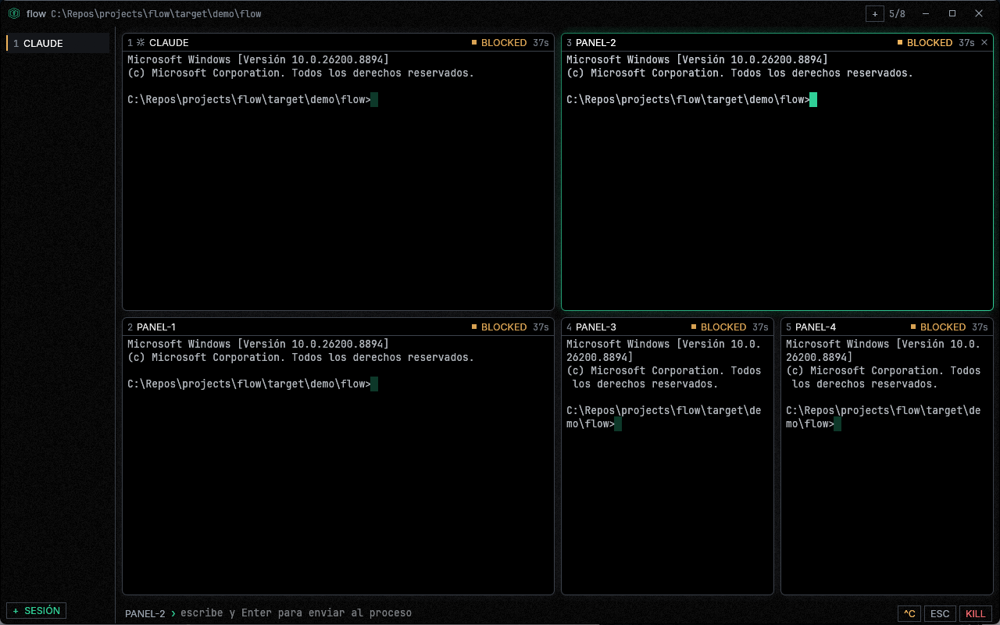
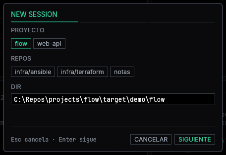
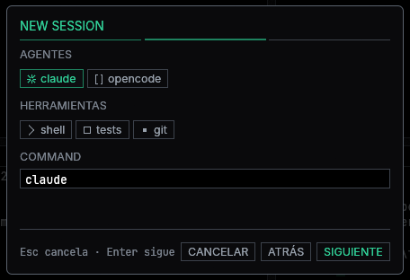
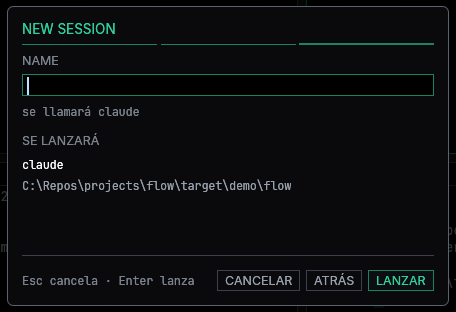
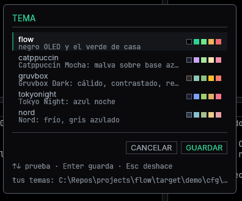

# flow

Orquestador minimalista de agentes CLI. Lanza varios procesos a la vez —`claude`,
`codex`, `cargo test`, lo que sea— cada uno en un pseudo-terminal real, y te dice
de un vistazo cuál está trabajando, cuál terminó y cuál se ha quedado esperando
que le contestes.

GUI nativa en Rust. Un solo binario, sin Electron, sin servidor, sin navegador.



*Cinco procesos a la vez. El del borde verde es el que te escucha; el estado de
cada uno va en su cabecera y el resumen de la sesión, en la columna.*

## Cómo se empieza

### Descargarlo (Windows, sin instalar nada)

**[⬇ Descargar `flow.exe`](https://github.com/Alexis-Reillo-Segarra/flow/releases/latest)**
— la última versión, en la página de releases.

Es **un único fichero** de 11 MB. Cópialo donde quieras —el escritorio, una
carpeta cualquiera— y ábrelo. No lleva instalador, no escribe en el registro, no
necesita permisos de administrador y no hay nada que instalar antes: el CRT va
enlazado estático a propósito (ver `.cargo/config.toml`), así que tampoco pide el
redistribuible de Visual C++.

Si lo quieres poder abrir escribiendo `flow` desde cualquier terminal, déjalo en
una carpeta que esté en el `PATH`. Para desinstalarlo, borra el fichero.

Dos cosas que van a pasar la primera vez:

- **Windows dirá que ha protegido el PC.** Es SmartScreen, y sale con cualquier
  ejecutable sin firma digital, no porque el programa tenga nada raro: *Más
  información* → *Ejecutar de todas formas*. Quitarlo de en medio requiere un
  certificado de firma de código, que se paga.
- **El antivirus puede tardar un rato** la primera vez. Normal en binarios
  nuevos y sin reputación.

### Compilarlo (cualquier sistema)

Solo hace falta el toolchain de Rust ([rustup.rs](https://rustup.rs)) — no hay
dependencias del sistema que instalar, ni SDKs, ni `pkg-config`. Las fuentes van
embebidas en el binario:

```
git clone https://github.com/Alexis-Reillo-Segarra/flow.git
cd flow
cargo run --release            # probarlo
cargo install --path .         # dejarlo instalado: luego se abre escribiendo `flow`
```

`cargo install` lo copia a `~/.cargo/bin`, que ya está en el `PATH`. Para
desinstalarlo, `cargo uninstall flow`.

**Para actualizar el que ya tienes instalado**, `git pull` y vuelve a lanzar
`cargo install --path .`: sobrescribe el binario de `~/.cargo/bin`. Mientras no
lo hagas seguirás abriendo el de la última vez, aunque el código del repositorio
haya cambiado.

El código es multiplataforma —usa `$SHELL` y `$XDG_CONFIG_HOME` fuera de
Windows— pero **quien lo desarrolla y lo prueba trabaja en Windows**, que es de
donde salen los binarios publicados. En Linux y macOS se compila desde fuente, y
en Linux hacen falta las bibliotecas de ventanas habituales de cualquier GUI
(`libxkbcommon`, X11 o Wayland). Si algo no va en tu sistema, [abre un
issue](https://github.com/Alexis-Reillo-Segarra/flow/issues).

El binario no tiene dependencias en tiempo de ejecución: las dos tipografías van
embebidas y las dos son OFL, así que se puede redistribuir sin más (ver
[licencias](#licencias)).

## Cómo funciona, en un minuto

Al abrirlo no hay nada: flow no adivina qué querías lanzar. `Ctrl-N` abre una
sesión nueva, y el formulario pregunta **de una cosa en una**, siguiente,
siguiente, siguiente. Son tres preguntas y en cada una hay algo que pulsar, así
que se puede recorrer entero sin escribir: `Enter` avanza y `Enter` en el último
paso lanza.

**1 — Dónde.** Sobre qué directorio se trabaja. Arriba, los proyectos que ya has
usado; debajo, los repositorios que flow ha encontrado solo en tu equipo. El que
está puesto ahora lleva el borde en verde. Si escribes una ruta que no existe, se
avisa y el botón del final pasa a llamarse `CREAR Y LANZAR`.



**2 — Qué.** Qué se lanza ahí dentro. Solo salen los agentes que tienes de verdad
en el `PATH`, cada uno con su marca; pulsas uno y rellena el comando, que sigue
abajo por si querías otra cosa. De aquí no se sale con el comando en blanco.



**3 — Lanzar.** Cómo se va a llamar el panel —si no pones nada, se llama como el
comando— y un resumen de lo que va a pasar antes de que pase.



La raya de debajo del título es el indicador de paso: los tramos hechos y el de
ahora van en verde, el que falta en gris, y el de ahora es el más grueso.

A partir de ahí, la sesión existe y el proceso corre en un PTY de verdad.
`Ctrl-T` le añade paneles —hasta ocho, todos sobre el mismo directorio—, la
rejilla se reparte sola, y la barra de abajo escribe en el panel que tenga el
foco. Añadir un panel se queda en dos pasos en vez de tres: el directorio no se
pregunta porque un panel hereda el de su sesión.

## Qué hace

- **Sesiones.** Lanzar un agente abre una sesión, y dentro caben hasta ocho
  paneles **sobre el mismo directorio**: el agente y las terminales desde las
  que miras lo que hace, o los subagentes entre los que reparte el trabajo.
- **Se lanza contestando tres cosas.** Dónde, qué y cómo se llama, de una en
  una. Los directorios se eligen de una lista —lo que ya has usado, y los
  repositorios que flow ha encontrado solo en tu equipo—, así que abrir sesión no
  pide teclear una ruta.
- **Los agentes saben que están dentro.** Cada proceso recibe el entorno de su
  sesión y un buzón por el que puede pedir que le abran un panel al lado: lo que
  ejecuta se ve en una terminal de su propia sesión en vez de en ningún sitio.
- **Ocho paneles a la vez, en mosaico.** Todos en pantalla al mismo tiempo, sin
  pestañas: si tienes cuatro procesos trabajando, ves trabajar a los cuatro. El
  reparto se recalcula solo con la forma de la ventana.
- **PTYs de verdad.** No se captura stdout por tubería: se abre un pseudo-terminal,
  así que los procesos hijos se creen interactivos, emiten color y pueden pedirte
  datos. Funciona con cualquier CLI sin integrarlo.
- **Estado de un vistazo.** `WORKING` late, `BLOCKED` parpadea, `DONE` y `EXIT`
  se quedan quietos. Saber que un agente lleva cinco minutos esperando una
  respuesta no debería requerir abrirlo.
- **Emulador de terminal propio.** Rejilla de celdas, scrollback, SGR completo
  (16 colores, 256 y truecolor), alt-screen y región de scroll. Aguanta tanto
  salida en flujo como una TUI a pantalla completa.
- **Le puedes escribir.** La barra inferior manda texto al panel con el foco, con
  botones para `Ctrl-C` y `ESC`.
- **Temas.** Cinco incluidos —el negro OLED de casa, Catppuccin, Gruvbox, Tokyo
  Night y Nord—, se cambian en caliente con `Ctrl-Shift-T` y se pueden escribir
  los tuyos en un fichero de texto. Ninguno puede dejar la interfaz ilegible:
  [pasan un contrato de contraste](#temas).

## Cualquier agente

flow no integra ningún agente en concreto: todos son procesos de terminal, así
que **cualquier CLI vale**. Puedes tener a la vez una terminal de Claude Code,
otra de Codex y otra corriendo los tests, cada una en su PTY.

El formulario de lanzamiento detecta al abrirse qué agentes tienes de verdad en
el `PATH` y solo ofrece esos, para que la lista se adapte a tu máquina en vez de
enseñarte nombres que no existen:

|              |                                                                                           |
| ------------ | ----------------------------------------------------------------------------------------- |
| Agentes      | `claude`, `codex`, `gemini`, `opencode`, `aider`, `cursor-agent`, `amp`, `goose`, `crush` |
| Herramientas | `shell`, `tests`, `git`                                                                   |

Añadir uno nuevo es una entrada en `CATALOG`, en `src/presets.rs`. En Windows la
detección prueba también las extensiones de `PATHEXT`, porque casi ningún CLI de
Node es un `.exe`: `claude` suele ser en realidad `claude.cmd`.

## Sesiones

Una sesión es **un agente y lo que le hace falta alrededor**. Nace cuando lanzas
un agente, se queda con su directorio, y dentro caben hasta ocho paneles que
comparten ese directorio. Sirve para las dos cosas que uno acaba queriendo:

- **Mirar.** Mientras `claude` escribe código en su panel, en el de al lado
  abres un shell en su mismo directorio y ves por línea de comandos lo que está
  haciendo, sin salir de la app ni acordarte de en qué carpeta trabajaba.
- **Repartir.** Si el trabajo se abre en cinco subagentes, los cinco caben en la
  misma sesión, a la vista a la vez, en vez de ser cinco cosas sueltas que no se
  sabe de quién eran.

La columna de la izquierda lleva una fila por sesión con el estado **resumido**
de todos sus paneles: si un `cargo test` revienta en la sesión tres, se ve desde
la uno. Estuvo arriba en horizontal y se bajó porque el sitio que tiene una
sesión para crecer es hacia abajo: con seis, la tira ya obligaba a quedarse solo
con el número, que es lo único que no distingue una sesión de otra. Cuando la
ventana se estrecha, la columna se encoge a los números para no comerle columnas
al terminal.

## Proyectos y repositorios

Una sesión vive atada a un directorio —es lo que comparten sus paneles—, y ese
directorio había que teclearlo entero cada vez. Un **proyecto** es solo eso: una
ruta que ya has usado. Al abrir sesión salen los últimos doce y basta con pulsar
su nombre.

Eso no sirve la primera vez, claro: recién descargado no has usado ninguna. Por
eso flow **busca tus repositorios él solo** al arrancar y los ofrece en un grupo
aparte, debajo. Es un `.git` dentro de una carpeta, y da igual que sea fichero o
directorio, así que los *worktrees* y los submódulos también cuentan.

Los dos grupos van separados a propósito y en ese orden: lo que has abierto tú
manda sobre lo que te propone la máquina, y mezclarlos haría que la lista bailara
entre arranques sin que hayas hecho nada. Lo que ya está arriba no se repite
abajo.

**Dónde busca, y por qué no en todas partes.** Barrer el disco entero está
descartado: son cientos de miles de directorios, un `stat` por entrada pasando
por el antivirus, y basta una unidad de red o una carpeta que descargue a demanda
para quedarse minutos colgado. La señal buena sale gratis: si trabajas en
`C:\Repos\projects\flow`, entonces `C:\Repos\projects` es una huerta de
repositorios. A eso se le suman los sitios de siempre —`~\source\repos`,
`~\Documents\GitHub`, `~\dev`, `~\code`…—, tres niveles de profundidad, y se poda
al encontrar: dentro de un repositorio no se sigue bajando. No se ejecuta `git`
ni una vez; la rama se lee de `.git/HEAD`, que es un fichero de una línea.

Se ordenan por la fecha de `.git`, que es «cuándo trabajé aquí por última vez»
sin ejecutar nada, y se ofrecen diez como mucho: pasado ese punto la lista deja de
ser una sugerencia y pasa a ser un explorador de archivos. Todo esto corre en un
hilo aparte y **una sola vez por ejecución**, porque lo que tarda no lo decide el
número de carpetas sino el antivirus, y la ventana no puede quedarse quieta por
eso.

Si escribes una ruta que todavía no existe, no es un error: el formulario lo
avisa debajo del campo y el botón pasa a llamarse `CREAR Y LANZAR`, así que la
carpeta se crea, pero nunca sin que lo hayas leído antes.

La lista se guarda en `%APPDATA%\flow\projects` —o `$XDG_CONFIG_HOME/flow/projects`
fuera de Windows—, una ruta por línea y la más reciente arriba. Junto al fichero
de [temas](#temas) es lo único que flow escribe en tu disco aparte de los buzones
del temporal, y no es crítico: si no se puede escribir, la app funciona igual y
simplemente no recuerda.

## Temas

`Ctrl-Shift-T` abre la lista. Vienen cinco:



**Lo que eliges se ve mientras lo eliges**: moverse por la lista aplica el tema
de verdad a la app entera —los paneles, el grano, la salida de los procesos—, no
a una miniatura. Un tema se juzga con la terminal llena de texto. `Esc` deja las
cosas como estaban, así que probar no cuesta nada.


| Tema         | Qué es                                                |
| ------------ | ----------------------------------------------------- |
| `flow`       | El de casa: negro OLED (`#000000`) y el verde de marca |
| `catppuccin` | Catppuccin Mocha: malva sobre base azulada            |
| `gruvbox`    | Gruvbox Dark: cálido, contrastado, retro              |
| `tokyonight` | Tokyo Night: azul noche                               |
| `nord`       | Nord: frío, gris azulado                              |

**Moverse por la lista aplica el tema de verdad**, a la app entera y no a una
miniatura: los paneles, el grano del fondo y la salida de los procesos que ya
estaban escritos. Un tema se juzga con la terminal llena de texto, y una muestra
de 60×20 píxeles no dice nada de lo que vas a estar mirando seis horas. `Enter`
se queda con el que estés probando y `Esc` deja las cosas como estaban, que es lo
que hace que probar no cueste nada.

### Un tema es un contrato, no una lista de gustos

Los cinco pasan los mismos tests, y **todos los temas** los pasan, no solo el
activo:

1. Los cuatro niveles de texto cumplen 4,5:1 contra **su** fondo, y también
   atenuados —con `dim_inactive`, el nivel más tenue de un panel sin foco es el
   peor caso real de la interfaz—.
2. El acento tiene dos caras, una de trazo (≥3:1) y una de texto (≥4,5:1), **con
   el mismo tono**. No se escriben las dos: la de trazo sale de escalar la otra,
   y escalar los tres canales por igual no mueve el tono.
3. Los cuatro colores de estado cumplen 4,5:1 y se separan entre sí por tono, no
   solo por claridad: quien no distinga rojo de verde tiene que poder
   distinguirlos igual.
4. Ningún slot ANSI es exactamente el acento, y el cian sigue siendo cian.

De ahí salen las únicas licencias que se han tomado con las paletas originales:
el rojo de Gruvbox y el de Nord no llegaban a 4,5:1 sobre su propio fondo y se
han aclarado lo justo. El acento de Gruvbox tampoco es su naranja de siempre,
porque se quedaba a 13° de tono de su propio amarillo de aviso y el acento habría
dejado de distinguirse de un panel `BLOCKED`; se usa el aqua, que está a 100°.

### Escribirse uno

El fichero es `%APPDATA%\flow\config` —o `$XDG_CONFIG_HOME/flow/config` fuera de
Windows—, y el selector te enseña su ruta abajo del todo. flow lo escribe la
primera vez que guardas un tema, ya comentado con todas las claves.

```ini
theme = mío

[theme mío]
base   = gruvbox      ; hereda todo lo suyo
accent = #d3869b      ; menos el acento, que aquí es rosa
```

**Lo que no digas se hereda de `base`**, y esa es toda la gracia del formato: un
tema son veintitantos colores, y obligar a escribirlos todos para cambiar uno
habría hecho que nadie escribiera ninguno. Las claves son las de la paleta —`bg`,
`raised`, `sel`, `hover`, `line`, `line_hi`, `text`, `text_hi`, `text_dim`,
`text_faint`, `accent`, `accent_stroke`, `green`, `amber`, `red`, `slate` y
`ansi0`…`ansi15`—, los valores van en `#rrggbb` o `#rgb`, un `#` al principio de
línea es un comentario y `;` abre una nota al final de una que ya dice algo.

Dos cosas que conviene saber:

- **`base` tiene que ir antes que los colores**, porque es lo que decide desde
  dónde se parte.
- **Tu tema no pasa por los tests de contraste**, y no puede: se lee al arrancar,
  no al compilar. Por eso heredar de uno de los cinco y cambiar poco es lo que
  hace que empieces cumpliendo. Si el fichero tiene una errata, flow no se cae:
  la línea se descarta, el aviso sale por la salida de errores —lo ves si lo
  lanzaste desde una terminal— y todo lo demás se carga igual.

## Que el agente sepa que está dentro

Un agente lanzado aquí no sabe que está aquí: para él esto es una terminal
cualquiera. flow se lo dice por el entorno, y de paso le da algo que en una
terminal normal no existe —*ábreme esto al lado*—:

| Variable          | Qué es                                             |
| ----------------- | -------------------------------------------------- |
| `FLOW`            | `1`. Estás dentro de flow                          |
| `FLOW_SESSION`    | Nombre de tu sesión                                |
| `FLOW_SESSION_ID` | Su identificador                                   |
| `FLOW_DIR`        | El directorio que comparten sus paneles            |
| `FLOW_INBOX`      | El buzón: por aquí se piden paneles                |
| `FLOW_BIN`        | La ruta del propio flow, por si no está en el PATH |
| `FLOW_PANES`      | Cuántos caben por sesión                           |
| `FLOW_HOWTO`      | Todo lo anterior explicado en prosa, para el modelo |

### `flow run`

Para abrir un panel en tu propia sesión:

```
flow run cargo test
flow run npm run dev
```

Y si flow no está en el `PATH` —porque te copiaste el `.exe` a una carpeta
cualquiera, que es una forma legítima de tenerlo— la misma llamada por su ruta,
que llega en `FLOW_BIN`.

**`flow run` no ejecuta nada**: escribe la petición y se va. El que lanza el
proceso es flow, en su propio PTY, que es lo que lo convierte en un panel de
verdad y no en la salida de un proceso colgando de otro. De ahí lo único que hay
que entender para usarlo bien: **la salida no vuelve a quien lo pidió**, se ve en
el panel.

Eso reparte el trabajo solo:

- Lo corto, y cuya respuesta el agente **necesita leer** para seguir —`git
  diff`, un typecheck— se queda donde estaba: en su propia herramienta.
- Lo que dura o interesa mirar —un servidor, la suite larga, seguir un log, un
  subagente— va a `flow run`, y se ve trabajar al lado.

### Por debajo es un fichero

`flow run` solo escribe el comando en un fichero nuevo dentro de `FLOW_INBOX`, y
eso sigue siendo el protocolo: se puede hacer a mano.

```
echo cargo test > "%FLOW_INBOX%\1.cmd"     :: Windows
echo cargo test > "$FLOW_INBOX/1.cmd"      # el resto
```

flow lo lee cada 300 ms, borra el fichero y abre el comando como un panel más
al lado, en el mismo directorio y con el mismo entorno. Un fichero, un panel.

Es un directorio y no un puerto, un socket o un binario auxiliar porque
cualquier cosa sabe escribir un fichero —un agente, un script, un `echo` a
pelo— en cualquier lenguaje y en los dos sistemas, sin que flow tenga que abrir
nada al exterior. El buzón vive en el temporal del sistema, lleva el PID de flow
y se borra al cerrar la sesión.

El subcomando existe porque el `echo` se usaba poco y mal: había que acordarse de
la ruta del buzón, inventarse un nombre de fichero que no chocara con otro y
acertar con la redirección y las comillas, que no se escriben igual en `cmd`, en
PowerShell y en un shell de Unix. Y cuando fallaba, fallaba en silencio: el
fichero se escribía con el comando a medias y lo que aparecía al lado era un
panel con un error raro. `flow run` además escribe fuera del buzón y mueve el
fichero dentro de un tirón, así que flow no puede leerlo a medio escribir.

**Lo que flow no puede hacer** es obligar a un agente de terceros a usarlo:
puede ofrecer el mecanismo y anunciarlo, pero no meterse en el prompt de otro
programa. Para que lo use de verdad, dile en su fichero de contexto —el
`CLAUDE.md` o `AGENTS.md` del proyecto— algo así:

```markdown
Si la variable FLOW está puesta, estás dentro del orquestador flow. Lee
FLOW_HOWTO. Todo proceso que dure o que interese mirar (servidores, suites de
tests largas, builds, seguir un log, subagentes) lánzalo con `flow run <comando>`
—o "%FLOW_BIN%" run <comando>— para que se vea en una terminal de esta misma
sesión en vez de ejecutarlo donde nadie lo ve. Ojo: la salida de `flow run` no
vuelve a ti, se queda en su panel, así que lo que necesites leer para seguir
trabajando ejecútalo como siempre.
```

Un aviso: quien pueda escribir en el buzón puede hacer que flow lance procesos.
Está en el temporal del usuario, así que no da a nadie nada que no tuviera ya
—cualquier proceso tuyo puede lanzar procesos—, pero conviene saberlo.

## Atajos

**Ctrl** se mueve entre sesiones y **Alt**, dentro de la que estás mirando.

| Tecla          | Acción                                             |
| -------------- | -------------------------------------------------- |
| `Ctrl-N`       | Abrir una sesión nueva                             |
| `Ctrl-T`       | Añadir una terminal o un agente a esta sesión      |
| `Ctrl-Shift-T` | Cambiar de tema                                    |
| `Ctrl-W`       | Cerrar el panel con el foco                        |
| `Ctrl-Shift-W` | Cerrar la sesión entera, con todos sus procesos    |
| `Ctrl-1`…`9`   | Saltar a la sesión n-ésima                         |
| `Alt-1`…`8`    | Saltar al panel n-ésimo de la sesión               |
| `Alt`+flechas  | Mover el foco al panel de al lado                  |
| `Enter`        | En el formulario: pasa al siguiente paso, o lanza  |
| `Esc`          | Cerrar el formulario                               |

## Diseño

### La rejilla

El espacio no se reparte con una tabla de N×M sino cortando el rectángulo
disponible **por su lado largo**, una y otra vez, hasta que hay un hueco por
panel. La mitad con menos paneles va primero, así que el agente más antiguo se
queda el hueco grande.

De ahí sale la única propiedad que se le pide: **se adapta sola**. Los mismos
ocho paneles caen en 4×2 con la ventana en horizontal y en 2×4 si la estrechas,
sin nada que configurar y sin que la app sepa nada de resoluciones. Maximizada,
a media pantalla o en un monitor vertical es el mismo código.

Los paneles no saltan de sitio: cada uno persigue su hueco con un suavizado
exponencial de unos 165 ms. Abrir o cerrar uno reorganiza la rejilla deslizando,
que es la diferencia entre entender lo que pasó y encontrarte otra pantalla.

El tope de **ocho por sesión** no es técnico: repartida una pantalla normal entre
más, cada panel deja de tener columnas suficientes para que la salida de un CLI
se lea sin partirse. Sesiones puede haber las que quieras.

### Espacio

La estructura se lee por el **hueco**: los mismos 8 px separan un panel del de al
lado y del borde de la ventana. Un panel lleva 6 px de redondeo —lo justo para
que se lea como una ventana suelta y no como la celda de una tabla— y todo lo que
va dentro sigue con esquina viva, para que el redondeo signifique una cosa
concreta: esto es una ventana.

Quién tiene el foco lo dice el marco: el activo lo lleva en un degradado de las
dos claridades del verde de marca, a 45°, y los demás en gris. Como refuerzo, el
**contenido** de los otros siete baja un 10% —solo la tinta; el marco y las
divisorias se quedan enteros, porque una rejilla con siete bordes medio borrados
se deshace—.

Ese 10% es deliberadamente poco. Atenuar de verdad siete procesos para destacar
uno sale más caro de leer de lo que vale: están los ocho en pantalla porque la
promesa es que los ves trabajar a todos. Y no sale gratis: los dos niveles de
gris más flojos se subieron para que **atenuados** sigan cumpliendo AA, así que
un panel apagado se lee hoy igual de bien que se leía toda la interfaz antes de
que esto existiera. Lo que el atenuado hace, en realidad, no es oscurecer siete:
es aclarar el que te escucha.

### Color

Lo que sigue describe el tema de casa. Los otros cambian los valores, pero no la
estructura: los papeles son los mismos en los cinco y ninguno estrena un color
que no signifique nada (ver [temas](#temas)).

Tres colores llevan el peso: **negro puro** de fondo, **gris** en las divisorias
de 1 px y el **verde de la marca** (`#1E825F`) en todo lo que es flow hablando —
el logo, el marco del panel con el foco, el cursor—. No hay tarjetas grises ni
rellenos decorativos: la estructura se lee por las líneas, no por bloques de
tono.

El negro es `#000000` exacto, y es una decisión, no una casualidad: en un panel
OLED ese valor es el píxel **apagado**, un negro que ninguna otra pantalla sabe
dar. Subirlo aunque fuera un punto lo encendería entero. Es también la razón de
que el tema de casa siga siendo el de fábrica y de que ninguno de los otros
cuatro le toque el fondo: un tema es justo eso, y este no lo cambia.

### Grano y profundidad

Un negro absoluto y liso a pantalla completa no le da al ojo ninguna referencia,
y deja de saber si mira una superficie o un agujero. Por eso el fondo lleva una
capa de **grano**: motas de blanco a un 6% de opacidad como mucho, así que la
inmensa mayoría de los píxeles siguen siendo negro exacto y el OLED sigue
apagado. El grano vive solo en el fondo —huecos, barra y columna—; los paneles se
rellenan de negro liso encima, y la salida de un proceso no se lee jamás sobre
ruido.

Los paneles llevan además un **halo**: la sombra de un gestor de ventanas, pero
invertida. Hay una razón física para ello —una sombra oscurece lo que tiene
debajo, y sobre `#000000` no queda nada que oscurecer—, así que la profundidad se
da al revés, con un desvanecido de luz hacia fuera del panel. El efecto para el
ojo es el mismo que busca la sombra de Hyprland: que la ventana se lea despegada
del fondo y no recortada sobre él. El del panel con foco va teñido de verde,
como la sombra coloreada de la ventana activa de allí; no es una señal más, es el
borde derramándose.

### Las marcas de los agentes

Cada agente conocido lleva una forma —el destello, el anillo, los corchetes— en
su botón del formulario y en la cabecera de su panel, para que en una rejilla de
ocho se vea de un golpe cuál es el `claude` y cuál el shell.

**No son los logotipos oficiales.** flow no empaqueta recursos de marca ajenos:
son formas geométricas propias, dibujadas con segmentos como todo lo demás,
elegidas para evocar a cada agente y, sobre todo, para distinguirse entre ellas a
diez píxeles, que es el trabajo que tienen que hacer.

El verde de marca vive en dos claridades, que son el mismo tono (159°) y se
eligen por lo que va a pintar, no por gusto:

| Campo         | Valor     | Contraste | Dónde                                                          |
| ------------- | --------- | --------- | -------------------------------------------------------------- |
| `accent`      | `#1E825F` | 4,41:1    | Marcos, trazos, rellenos, logo; extremo oscuro del degradado    |
| `accent_text` | `#30CF97` | 10,50:1   | Rótulos, glifos finos, el bloque del cursor; extremo claro      |

La razón es de contraste: la WCAG le pide 3:1 a un componente de interfaz y
4,5:1 a un texto. `#1E825F` cumple lo primero pero no lo segundo, así que en
cuanto el acento tiene que ser una letra se sube a la variante clara. El test
`theme::tests::el_acento_de_flow_cumple_lo_de_un_componente_de_interfaz` impide
que alguien lo use de color de texto sin enterarse.

Las dos caras no se escriben por separado: la oscura es la clara escalada por
0,627, y de ahí que compartan tono exacto —escalar los tres canales por igual no
lo mueve—. Un tema propio declara solo `accent` y la otra sale sola.

El degradado del panel con foco va de una a la otra en vez de estrenar un tercer
verde: son los dos tonos que ya existen, comparten tono, y los dos pasan de sobra
el 3:1 de un trazo, así que el marco cumple **en todo su recorrido** y no solo en
un extremo. Lo comprueba
`theme::tests::el_degradado_del_foco_es_trazo_valido_de_punta_a_punta`.

Aparte del verde de marca hay cuatro colores que solo hablan de estado y nunca
se usan de adorno. Si ves color en flow, significa algo:

| Color | Estado                                           |
| ----- | ------------------------------------------------ |
| Verde | `WORKING` (latiendo) y `DONE` (sólido)           |
| Ámbar | `BLOCKED` — el único estado que reclama atención |
| Rojo  | `EXIT` con código ≠ 0 y `FAILED`                 |
| Gris  | `IDLE`                                           |

> **Nota de diseño.** El verde de marca y el verde de estado son ahora
> parientes, y antes no lo eran: con el acento en cyan, "verde" solo podía
> significar estado. Hoy se distinguen por el sitio —el acento no aparece nunca
> como marca de estado, y una marca de estado lleva siempre su palabra al lado—
> pero es la regla más floja de la paleta. Está anotada en
> [mejoras propuestas](#mejoras-propuestas-de-interfaz). En los cuatro temas
> portados el acento está a 76° o más del estado más cercano; el tema de casa,
> con sus 27°, es el que peor lo lleva.

### Tipografía

Dos familias, cada una con un trabajo:

| Familia                                                     | Uso                                 | Licencia |
| ----------------------------------------------------------- | ----------------------------------- | -------- |
| [Inter](https://rsms.me/inter/)                             | Nombres, estados, botones, rótulos  | OFL      |
| [JetBrains Mono](https://www.jetbrains.com/lp/mono/)        | Salida de procesos, rutas, comandos | OFL      |

Inter es un grotesco neutro dibujado para leerse en pantalla a cuerpos pequeños.
No aporta carácter, y eso es exactamente lo que se le pide: el carácter lo pone
la rejilla, no la letra. JetBrains Mono lleva todo lo que sale de un proceso,
porque el terminal exige monoespaciada, y de paso las cifras y las rutas del
chrome, donde importa distinguir `l` de `1`.

Las dos traen Latin-1 completo, así que no hay texto que no se pueda escribir, y
las dos son de contorno: no hay retícula de píxeles que respetar.

### Por qué la escala la decide el sistema

Aquí hubo antes dos fuentes de pixel-art atadas a su ladrillo, y de ahí salía
media docena de reglas raras: la escala tenía que ser un número entero, existía
un selector `1× 2× 3×` en la barra de título y luego una heurística que lo
elegía por el tamaño de la ventana. Con Inter y JetBrains Mono, que son de
contorno, nada de eso hace falta.

Hoy `app::auto_scale` hace lo que hace cualquier aplicación: **seguir al
sistema**. Si tienes el escritorio al 150%, flow va al 150%.

La única corrección es para pantallas grandes con el escalado del sistema en
100% —un 4K donde 13 puntos son 13 píxeles de nada—: ahí se agranda un 50%. Se
mira el tamaño del **monitor** y no el de la ventana a propósito, porque es un
dato que no cambia mientras arrastras el borde: redimensionar tiene que enseñar
más terminal, no letra más grande. Los tres casos están fijados en
`app::tests`.

El logo sí se sigue rasterizando en código, y ahora por una razón más simple:
su trazo es de 1 o 2 px, y escalar una imagen para llegar ahí lo convertiría en
un degradado gris. Se genera al número exacto de píxeles que va a ocupar, sea
cual sea el factor, y se cachea por tamaño.

### Movimiento

Hay exactamente seis cosas que se mueven, y ninguna es decorativa: o dicen dónde
estaba algo que se ha movido, o dicen que un proceso está vivo.

| Qué                     | Ritmo                            | Para qué                                    |
| ----------------------- | -------------------------------- | ------------------------------------------- |
| Reparto de la rejilla   | τ = 55 ms (95% en ~165 ms)       | Ver a dónde se fue cada panel                |
| Panel recién abierto    | 160 ms, de 94% a 100% y opacidad | Que nazca en vez de aparecer                 |
| Marca `WORKING`         | Seno, ciclo de 1,6 s             | Latido: hay algo pasando                     |
| Marca `BLOCKED`         | Cuadrada, 1,25 Hz                | Aviso: te está esperando                     |
| Subrayado de la pastilla | Cuadrada, 1,25 Hz                | Lo mismo, para sesiones que no estás mirando |
| Cursor del panel activo | 1,6 Hz                           | Dónde vas a escribir                         |

Tres decisiones que sostienen esto:

- **El deslizamiento va con el `dt` real**, no con un paso fijo por frame, así
  que dura lo mismo a 60 Hz que a 144.
- **Los parpadeos van a 1,25 Hz**, muy por debajo del límite de 3 destellos/s de
  la WCAG 2.3.1. Importa porque un `BLOCKED` puede estar en pantalla durante
  minutos.
- **El cursor solo parpadea en el panel con el foco.** En los otros siete se
  queda como una marca apagada al 30%: ocho cursores parpadeando a destiempo es
  justo el ruido que esta interfaz intenta no tener.

Mientras algo se mueve se pide repintado; cuando todo llega a su sitio y ningún
proceso está vivo, la app deja de dibujar y no consume CPU. El PTY no se
redimensiona hasta que el panel ha dejado de moverse: sería un `ioctl` y una
rejilla nueva por frame de animación para acabar exactamente donde iba a acabar.

## Accesibilidad

**Contraste.** Todo lo que es texto cumple WCAG AA (4,5:1) contra el fondo, y no
por confianza: lo comprueba `theme::tests::todo_lo_que_es_texto_cumple_aa`, que
recorre la paleta entera de **cada tema** y calcula la luminancia relativa. Si
alguien oscurece un color por debajo del mínimo, falla el `cargo test`.

Y lo cumple **también atenuado**, que es el caso real peor: el nivel más flojo de
uno de los siete paneles sin foco. Eso lo comprueba un segundo test,
`el_texto_de_un_panel_apagado_tambien_cumple_aa`, y es el que fija el techo del
atenuado: `text_faint` se queda en 4,58:1 al apagarse en el tema de casa, a un
pelo del mínimo. Un tercer test guarda el propio 0,90 dentro de un rango
acordado, para que bajarlo haga ruido al pasar los tests y no dos semanas
después.

Atenuar no es oscurecer: `dim_inactive` baja también la alfa, así que lo que se
ve es el color **mezclado con el fondo del panel**. Sobre el negro de casa daba
lo mismo —mezclar con negro es oscurecer—, pero sobre el fondo de un tema con
color no, y el test mide lo que se ve.

Las divisorias se quedan en 2,07:1 a propósito: son decoración, no transmiten
información, y subirlas más convertiría la rejilla en lo más ruidoso de la
pantalla. El acento se queda en 4,41:1 por la misma lógica —es marco y relleno,
nunca letra— y tiene su propio test que lo mantiene fuera del texto.

Los números de abajo son los del tema de casa. Los otros cuatro pasan los mismos
mínimos con los suyos:

|                             | vs negro                    | apagado                     |                            |
| --------------------------- | --------------------------- | --------------------------- | -------------------------- |
| `text`                      | 12,87:1                     | 10,40:1                     | AA                         |
| `text_dim`                  | 7,93:1                      | 6,50:1                      | AA                         |
| `text_faint`                | 5,48:1                      | 4,58:1                      | AA (mínimo permitido)      |
| `accent_text`               | 10,50:1                     | 8,48:1                      | AA                         |
| `accent`                    | 4,41:1                      | —                           | AA solo como componente    |
| Verde / ámbar / rojo / gris | 13,44 / 11,39 / 7,02 / 5,70 | 10,83 / 9,21 / 5,80 / 4,77  | AA                         |
| `line`                      | 2,07:1                      | —                           | decoración, no informa      |

`accent` y `line` no llevan columna de apagado porque nunca la ven: el acento
solo pinta el marco del panel con foco, que por definición no se atenúa, y las
divisorias son estructura y se quedan enteras en los ocho.

**El color nunca va solo.** Cada estado se comunica por tres canales a la vez:
color, forma (relleno o hueco) y la palabra escrita al lado. Quien no distinga
verde de ámbar sigue leyendo `WORKING` y `BLOCKED`.

**Parpadeo.** El indicador de `BLOCKED` parpadea a 1,25 Hz, muy por debajo del
límite de 3 destellos/segundo de la WCAG 2.3.1. Importa porque puede estar en
pantalla durante minutos.

**Lectores de pantalla.** Media interfaz está pintada a mano con el `Painter`, y
eso para AccessKit no existe. Los botones, los controles de ventana, las
pastillas de la barra y las cabeceras de panel declaran su semántica
explícitamente; un panel se anuncia como "3, cargo, BLOCKED, 12s", con el número
y el estado dentro del nombre.

**Limitación conocida:** no hay navegación por `Tab`. Los widgets pintados a
mano no entran en el orden de foco de egui. Las rutas principales sí son
accesibles por teclado (`Ctrl-N`, `Ctrl-T`, `Ctrl-Shift-T`, `Ctrl-W`, `Ctrl-1`…`9`,
`Alt-1`…`8`, `Alt`+flechas, y el campo de entrada toma el foco solo al cambiar de
panel), pero llegar a los botones de la barra inferior requiere ratón. El
selector de temas sí se maneja entero con flechas, `Enter` y `Esc`.

## Rendimiento

La app está parada la mayor parte del tiempo: solo repinta cuando llega salida
de un proceso o cuando hay algo animándose. Sin agentes vivos no consume CPU.

Dónde se cuidó de verdad:

- **Render virtualizado.** `show_rows` solo construye las filas visibles, así que
  da igual que el scrollback tenga 5000 líneas: se montan ~40 `LayoutJob` por
  frame, no 5000.
- **Tramos fusionados.** Cada fila junta las celdas contiguas con el mismo
  estilo, así que una línea sin color es un solo tramo de texto en vez de 200.
- **Estado cacheado.** Analizar la última línea para decidir si es un prompt se
  hacía en cada frame. Ahora se hace una vez por ráfaga de salida y se invalida
  cuando llegan bytes nuevos: mientras el proceso siga callado, la respuesta no
  puede cambiar.
- **Búsqueda acotada.** `last_nonempty_line` se rinde tras 64 líneas en blanco.
  Antes, una pantalla vacía recorría las 5000 del scrollback montando un
  `String` por cada una.
- **Scrollback recortado.** Las líneas que salen por arriba pierden sus blancos
  finales antes de archivarse, que en salida de terminal es la mayor parte.

## Arquitectura

```
src/
  main.rs     arranque de eframe y opciones de ventana
  run.rs      `flow run`: pedir un panel desde dentro de una sesión
  app.rs      estado global, bucle de frame, escala automática y buzones
  session.rs  una sesión: sus paneles, su directorio y el entorno que ven
  agent.rs    un panel = un proceso en un PTY, con dos hilos y heurística de estado
  term.rs     emulador de terminal (rejilla, scrollback, ANSI)
  logo.rs     la marca, rasterizada en código
  presets.rs  catálogo de agentes y detección en el PATH
  theme.rs    los temas: paleta, contrato, fuentes, espacio y estilo
  config.rs   el fichero de configuración: tema activo y temas propios
  projects.rs los directorios que ya has usado
  ui/
    chrome.rs   barra superior, botones de ventana y bordes de resize
    bar.rs      la columna de sesiones de la izquierda
    grain.rs    el grano del fondo
    tiles.rs    el mosaico: reparto del espacio y marco de cada panel
    output.rs   la terminal de un panel
    prompt.rs   la barra de entrada
    spawn.rs    el formulario de lanzamiento
    themes.rs   el selector de temas
    widgets.rs  primitivas de dibujo
```

La UI es de modo inmediato, así que no puede añadir ni quitar paneles mientras
dibuja. En vez de pelearse con el borrow checker, cada vista devuelve un
`ui::Action` y `Flow::apply` los resuelve al final del frame: un único sitio donde
ocurren las mutaciones de verdad.

### Detección de estado

No hay forma general de preguntarle a un proceso arbitrario "¿me estás
esperando?", así que se deduce del ritmo de la salida y de la forma de la última
línea —igual que un humano mirando la terminal de reojo:

- Sale texto ahora mismo → `WORKING`
- Lleva >1,2 s callado y la última línea parece un prompt (`?`, `:`, `>`,
  `(y/n)`, `password`…) → `BLOCKED`
- Lleva >10 s callado → `IDLE`

Es una heurística y a veces se equivocará. Los tests de `agent.rs` fijan los
casos que importan.

## Limitaciones conocidas

- **Sin persistencia.** Al cerrar flow se matan todos los agentes. No hay
  reattach ni sesiones que sobrevivan, a diferencia de un multiplexor de
  terminal.
- **Sin caracteres de doble ancho.** CJK y emoji ocupan una celda en la rejilla,
  así que descuadran las columnas.
- **El comando pasa por el shell** (`cmd.exe /C` en Windows, `$SHELL -c` fuera).
  Es lo que hace que funcionen los shims `.cmd` de Node y las tuberías, pero
  significa que hay un proceso intermedio entre flow y el agente.
- **Sin reflow al redimensionar.** El contenido se recorta, no se reajusta. Al
  encoger, las filas en blanco de abajo se tiran antes que archivar por arriba,
  así que la salida corta de un proceso no se va de la vista.
- **Ocho paneles por sesión como tope**, y el reparto no se puede tocar a mano:
  no hay paneles flotantes, ni intercambiar dos de sitio, ni cambiar la
  proporción de un corte arrastrando su borde. Un panel tampoco se puede mover
  de una sesión a otra.
- **Lo que se pide al buzón con la sesión llena se descarta**, y desde dentro
  del agente no hay forma de enterarse: flow no le contesta. `flow run` tampoco
  puede avisar, porque el que descarta es flow y para entonces el subcomando ya
  terminó; por eso dice «pedido un panel» y no «abierto».
- **Lo que el agente ejecuta con sus propias herramientas no se ve como un
  panel.** Ese proceso lo lanza él, como hijo suyo y con la salida enganchada a
  sí mismo; flow solo ve los bytes que el agente escribe en su PTY, así que lo
  verás como el agente decida enseñártelo. Para verlo de verdad tiene que
  pedirlo con `flow run`. Meterse en medio exigiría interceptarle la creación de
  procesos —enganchar `CreateProcess`, inyectar una DLL, suplantarle el shell— y
  eso es otra clase de programa.

## Mejoras propuestas de interfaz

Ninguna está implementada. Van ordenadas por lo que aportan frente a lo que
cuestan, y cada una dice dónde tocaría.

**1. Separar el verde de marca del verde de estado.** Es la deuda que dejó el
cambio de acento. Con el acento en cyan, "verde" solo podía significar estado;
ahora hay dos verdes y la regla «si ves color, significa algo» se apoya en el
sitio y no en el tono. La salida más limpia es mover `GREEN` (`#6EE787`, tono
132°) hacia un tono claramente distinto del 159° de la marca —o al revés, llevar
el estado a un azul-verde— manteniendo el AA. Un test que exija una separación
mínima de tono entre `ACCENT` y cada color de estado lo dejaría clavado.

**2. Avisar de que un panel está desenganchado del final.** `agent.follow` ya
existe y se calcula cada frame en `ui/output.rs`, pero no se enseña: si subes
por el scrollback, el proceso sigue escribiendo y nada te dice que estás mirando
el pasado. Bastaría una marca en la cabecera del panel —una flecha abajo, o el
número de líneas nuevas— que además sirva de botón para volver al final. Es la
mejora con mejor relación valor/coste de la lista.

**3. Animar el cierre de un panel.** Abrir desliza y crece; cerrar desaparece de
golpe y los demás se reordenan. Cerrar el ciclo pide que `Tiling` conserve el
panel muerto unos 120 ms con su opacidad bajando, lo que implica una lista de
"fantasmas" aparte de `panes`, porque el `Agent` ya no existe cuando toca
dibujarlo.

**4. Navegación por `Tab`.** Es la limitación de accesibilidad que ya reconoce
este README. Media interfaz está pintada con el `Painter` y no entra en el orden
de foco de egui, pero las respuestas ya existen (`ui.interact` en cabeceras,
pastillas y botones): falta marcarlas como enfocables y pintarles un anillo de
foco. Con eso, llegar a los botones de la barra inferior dejaría de exigir ratón.

**5. Respetar "reducir movimiento" del sistema.** Los parpadeos cumplen la WCAG
2.3.1 por frecuencia, pero quien haya pedido menos animación en su escritorio
sigue viéndolos. Lo correcto sería leer esa preferencia y degradar a estático:
`WORKING` sólido, `BLOCKED` alternando color en vez de parpadeando, y el reparto
de la rejilla saltando directo a su sitio. egui no lo expone, así que habría que
consultarlo al sistema.

**6. Que la barra de entrada reserve lo que de verdad ocupa.** `ui/prompt.rs`
descuenta 168 px fijos para los botones, pero con el proceso vivo son tres
(`KILL`, `ESC`, `^C`) y muerto es solo `RESTART`. En el segundo caso el campo se
queda casi 90 px más corto de lo que podría. Medir los botones antes de repartir
el ancho lo arregla.

**7. Decir que una sesión que no estás mirando ha escrito.** El subrayado de la
pastilla resume el *estado*, no la *novedad*: una sesión que pasó a `IDLE`
después de soltar cien líneas se ve igual que una que lleva parada media hora.
Un punto junto al número, que se apague al visitarla, cubriría el hueco.

## Desarrollo

```
cargo test                 # emulador, estado, reparto, paleta y logo
cargo run --example pty_probe -- "tu comando"   # sonda de la capa PTY
```

Cada push y cada pull request pasan por `.github/workflows/ci.yml`: `cargo test`
y `cargo clippy -D warnings` en Windows. Publicar una versión es empujar una
etiqueta `vX.Y.Z`; `release.yml` compila y sube el `.exe` a la release.

`pty_probe` vuelca lo que llega del pseudo-terminal con marcas de tiempo. Fue lo
que destapó que ConPTY manda `ESC[6n` al arrancar y **se bloquea hasta que le
respondes**: sin esa respuesta el proceso no emite ni un byte. Está cubierto por
`term::tests::responde_a_la_consulta_de_cursor`.

## Licencias

Código bajo MIT. Las dos tipografías conservan la suya, y las dos son OFL:
[Inter](https://rsms.me/inter/) y [JetBrains
Mono](https://www.jetbrains.com/lp/mono/). Van embebidas en el binario y su
licencia viaja al lado del `.ttf`, en `assets/fonts/`. No hay nada que revisar
antes de distribuir: la OFL permite redistribuir e incrustar, y la marca se
dibuja en código (`logo.rs`), así que tampoco depende de ninguna fuente.
